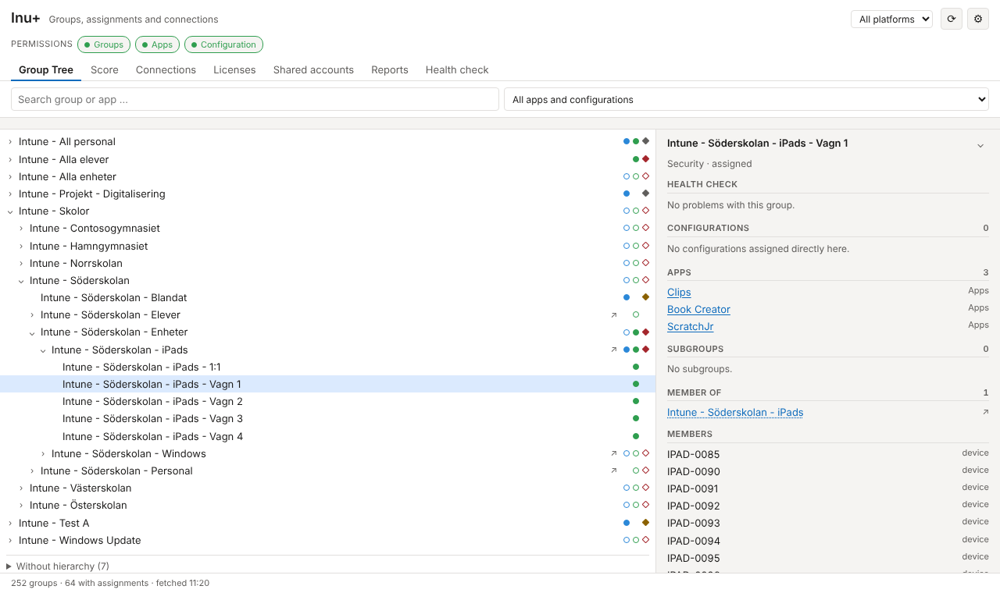
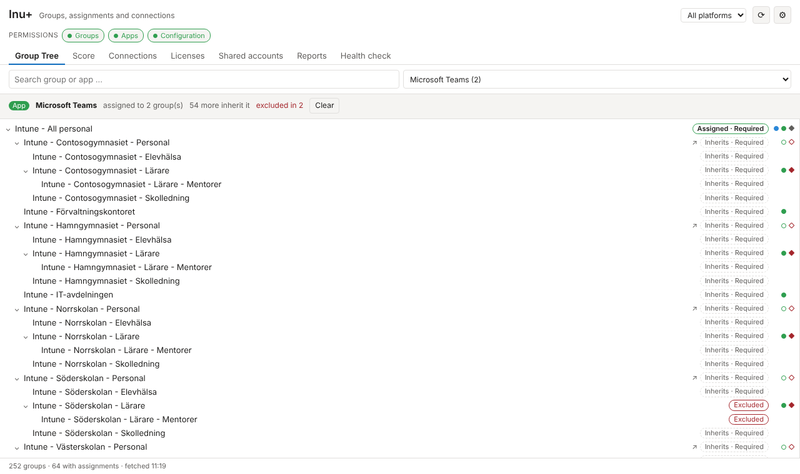
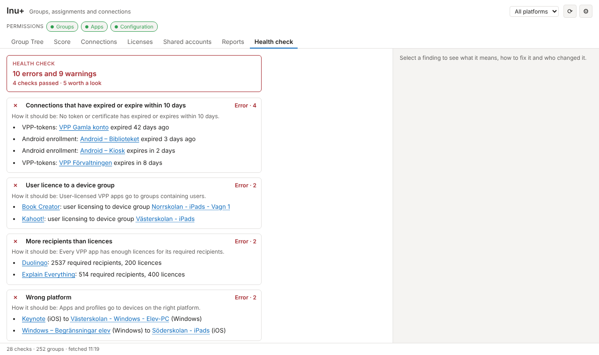
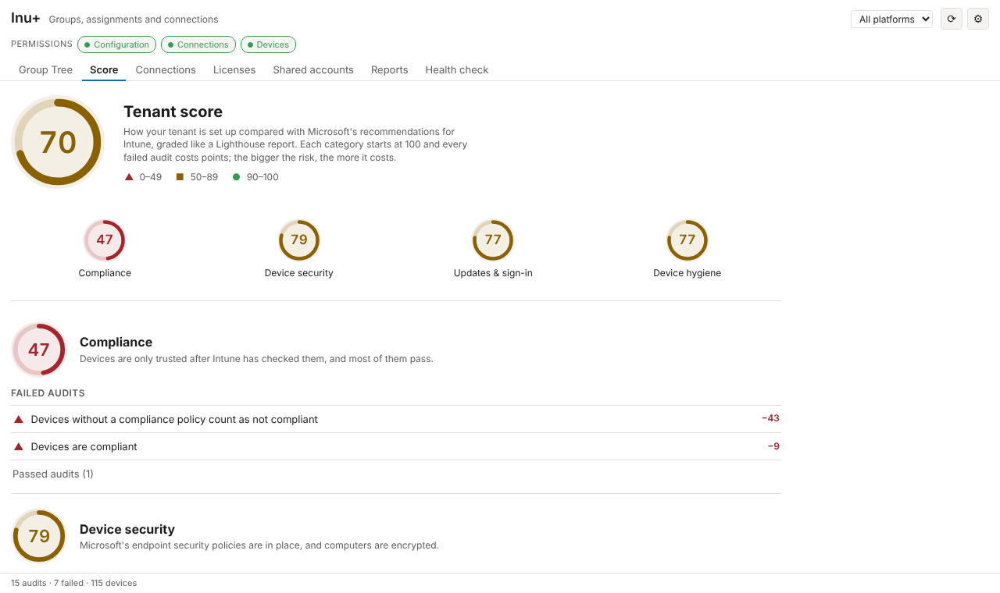
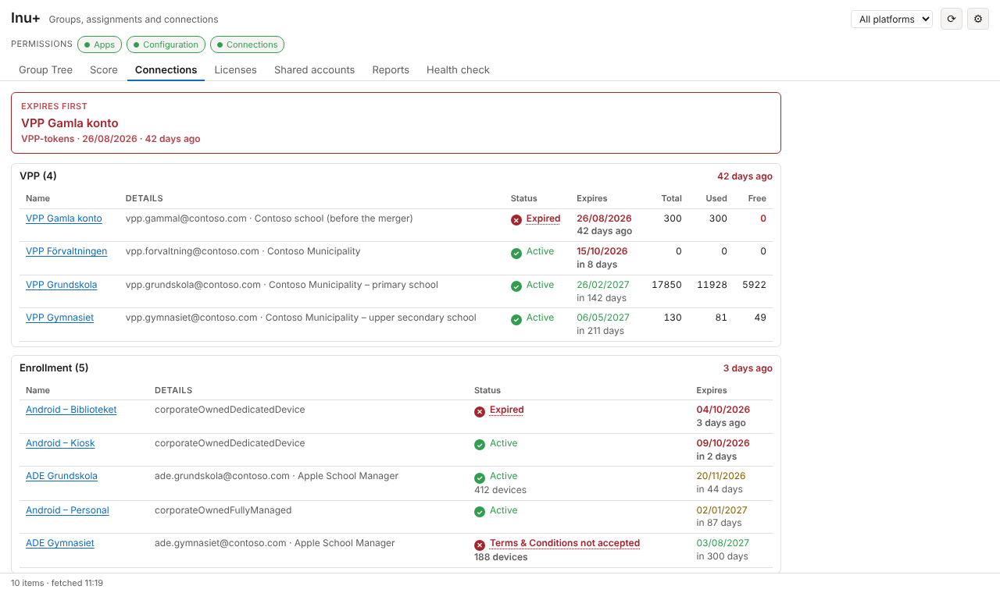
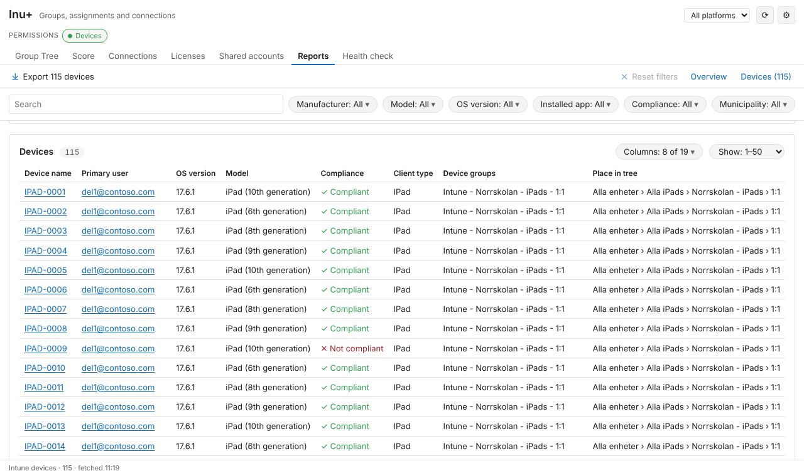

# Inu+

**A better view of your Intune tenant, inside the Intune portal.**

Inu+ is a browser extension for Microsoft Edge and Google Chrome. It adds a page
to the Intune admin center, right under **Home** in the left rail, that shows
your nested Entra groups as a tree with every app and configuration marked
where it is assigned. Around that it adds a health check of your assignments, a
tenant score, expiring connections, VPP licences, shared accounts and an
exportable device report.

It is built for people who run Intune for schools and municipalities, where
devices sit in deep group hierarchies (school › iPads › cart 1) and the portal's
flat lists make it hard to see what goes where.



- **Read-only.** Inu+ only reads. It never creates, changes or deletes anything
  in your tenant.
- **No server.** Everything runs in your browser. The only requests go to
  Microsoft.
- **Your own permissions.** It sees exactly what your account can see, nothing
  more.

**[Get Inu+ from the Chrome Web Store](https://chromewebstore.google.com/detail/inu+/oalgghjpilfemfcneeelcpjiiookipng)** — works in Chrome and
Microsoft Edge. Current version: **0.25** — see the [changelog](CHANGELOG.md).

## Contents

- [What's in it](#whats-in-it)
- [Getting started](#getting-started)
- [The tabs](#the-tabs)
- [Using the page](#using-the-page)
- [How Inu+ reads your tenant](#how-inu-reads-your-tenant)
- [Settings](#settings)
- [Privacy and security](#privacy-and-security)
- [Known limitations](#known-limitations)
- [Development](#development)

## What's in it

| Tab | What it shows |
| --- | --- |
| [**Group Tree**](#group-tree) | Your groups as a nested tree, with markers for apps and configurations. Search for an app to see every group it reaches. |
| [**Score**](#score) | How the tenant is set up compared with Microsoft's recommendations, graded 0–100 like a Lighthouse report. |
| [**Connections**](#connections) | VPP tokens, Apple enrollment (ADE), Android enrollment and the APNS certificate, sorted by what expires first. |
| [**Licenses**](#licenses) | VPP apps per token: licences total, used and free, and which groups get each app. |
| [**Shared accounts**](#shared-accounts) | How many devices each shared account is signed in on, against Intune's device limit. |
| [**Reports**](#reports) | Devices per municipality and client type, filtered your way and exported to a formatted Excel sheet. |
| [**Health check**](#health-check) | 28 checks for mistakes in assignments and groups, with how to fix each one. |

A **platform filter** at the top (All platforms, iOS/iPadOS, Windows, Android,
macOS) applies to every tab.

## Getting started

### Install

1. Open **[Inu+ in the Chrome Web Store](https://chromewebstore.google.com/detail/inu+/oalgghjpilfemfcneeelcpjiiookipng)** and click **Add to
   Chrome**. In Microsoft Edge, first click **Allow** when Edge asks about
   extensions from other stores, then **Add to Chrome**.
2. Open [intune.microsoft.com](https://intune.microsoft.com) and sign in.
3. Click **Inu+** in the left rail, directly under **Home**.

That's it. Installing opens nothing by itself — Inu+ waits in the portal's left
rail until you click it. Updates arrive automatically from the store.

The extension's toolbar icon also takes you to Inu+, in your portal tab or a new
one. **⧉** at the top of the page opens Inu+ in a tab of its own, which is handy
if you want it open while you work in the portal.

**Testing a version that isn't in the store yet?** Download the newest
[dev build](#dev-builds), unzip it, turn on **Developer mode** on
`edge://extensions` (or `chrome://extensions`), click **Load unpacked** and
choose the folder with `manifest.json`. Remove the store version first, or
you'll have two Inu+ entries.

### First run

The first time you open Inu+, it explains how it gets its data and lets you
choose:

- **Allow and use with my tenant** — borrow the access the portal already has
  for you. Nothing to set up.
- **Use my own app registration** — sign in through an app your organisation
  registers in Entra. See [Sign-in mode](#sign-in-mode).
- **Try the demo first** — a made-up tenant, nothing read from anywhere.

Until you choose, Inu+ reads nothing from the portal. You can change your mind
any time in [Settings](#settings). See
[How Inu+ reads your tenant](#how-inu-reads-your-tenant) for the difference.

### Try the demo

Turn on **Demo mode** in Settings to explore Inu+ without a tenant. It shows
Contoso, a made-up municipality with schools and around 250 groups, complete
with assignments, VPP licences, connections and devices. No sign-in, and no
request leaves the browser. The demo is messy on purpose: over twenty planted
mistakes are waiting for the Health check, and the demo notice on the page has
the answer key. Names in the demo are in Swedish, as in a Swedish school tenant.

## The tabs

### Group Tree

Your Entra groups as a tree — roughly the tree view from Intune for Education,
in the console you actually work in. Each row has markers:

| Marker | Means |
| --- | --- |
| ● blue | configuration assigned directly to the group |
| ○ blue | configuration assigned somewhere further down the branch |
| ● green | app assigned directly to the group |
| ○ green | app assigned somewhere further down the branch |
| ◆ red / yellow / grey | Health check error, warning, or something worth a look on the group |
| ◇ red / yellow | Health check finding further down the branch |

So you can see where something is deployed even when a branch is collapsed.

- **Search** narrows the tree to matching groups and opens the branches down to
  them.
- **Click a group** to see its details: Health check findings, assigned
  configurations and apps, subgroups, parent groups and members. **Open group**
  takes the portal tab to that group.
- A group with several parents is shown in each place, marked **↗**. A circular
  membership is cut and marked **⟲**.
- **Without hierarchy** at the bottom lists groups with neither parents nor
  children.

#### Where does an app go?

Type an app or configuration name in the search box — *Spotify*, a Wi-Fi
profile — and matching items appear as chips under it. Click one (or press
Enter when no group matches). The tree then shows every group the app reaches:

| Mark | Means |
| --- | --- |
| **Assigned · Required** | assigned directly to this group (or Available, Uninstall) |
| **Inherits** | a nested group under an assigned one — Intune follows nesting, so its members get the app too |
| **Excluded** | an exclusion stops it here, including everything under an excluded group |

A line above the tree counts them, and says so if the app is also assigned to
All users or All devices. **Clear** brings back the whole tree.



### Health check

Reviews your assignments and groups against 28 rules and lists what breaks
them, errors first. Each rule says how things should look; rules that passed
are listed too, so you can see they ran. Among other things it finds:

- user licences sent to iPad carts, and device licences sent to student groups
- "Available" assigned to device groups
- more recipients than licences for a VPP app
- apps and profiles assigned to the wrong platform
- users excluded from device assignments, and install and uninstall on the same devices
- empty and deleted groups, and licences locked up by disabled accounts
- duplicate Wi-Fi profiles, overlapping update rings, kiosk mode on large groups
- platforms without a compliance policy, and connections about to expire

Click a finding to see what it means, how to fix it (with links to Microsoft
Learn) and who changed the item recently. Findings also appear as diamonds in
the Group Tree; the two link to each other.

To know what each group contains, the check reads the first page (999) of
members of every group. In very large groups the counts are therefore minimums,
and the texts say "at least". A rule whose data could not be read shows as
unknown, never as passed. The fix texts are drafts based on Microsoft's
documentation (`src/health/guidance.js`); check them against your own
procedures.



### Score

A Lighthouse-style report for the tenant. Where the Health check finds mistakes,
Score grades how the tenant is **set up**, against what Microsoft recommends for
Intune.

| Category | Audits |
| --- | --- |
| **Compliance** | Devices without a compliance policy count as not compliant · compliance status validity · share of compliant devices |
| **Device security** | Disk encryption policy · share of encrypted Windows and macOS devices · antivirus · firewall · attack surface reduction · Windows LAPS · security baseline |
| **Updates & sign-in** | Windows update rings · Windows Hello for Business · personally owned Windows enrollment (tip only) |
| **Device hygiene** | Device cleanup rules · share of devices that checked in within 30 days |

Each audit scores 0–1 (pass/fail, or a curve for fleet shares). A category is
the weighted average, 0–100, and the tenant score is the average of the
categories: ▲ 0–49, ■ 50–89, ● 90–100. Every audit cites Microsoft Learn, and a
failed one says what was found and what it costs. Data that could not be read
is shown as *Not checked*, never as a pass.

Score reads policy settings and a device inventory summary (OS, compliance,
encryption and last check-in — no names, users or serial numbers). The audits
and weights are in `src/score/audits.js`; they are our reading of Microsoft
Learn, not a score Microsoft publishes.



### Connections

Everything that expires and must be renewed, in three groups: **VPP** tokens,
**Enrollment** (Apple ADE and Android enrollment profiles) and the **APNS**
certificate. Whatever expires first comes first, and a banner at the top names
it. ADE tokens show the same status as the portal; a bad status can be clicked
for the likely cause and the fix. VPP tokens show licences total, used and free,
and link to their apps in Licenses.



### Licenses

VPP apps per token, with licences total, used and free. Click an app to see who
gets it: which groups, as Required or Available, with device or user licensing,
and which groups are excluded. It uses the data the Group Tree already fetched.

### Shared accounts

How many devices each shared account is signed in on — the same number Intune
shows when you search for the account under Devices — and how many free places
are left under the device limit (15 by default). Shared accounts are recognised
by their name (`del`, `delad` by default: *del1*, *delad2* …), or you can list
every account with more than one device. Names and limit are set in Settings.

### Reports

Devices per municipality and client type — the report an Excel sheet with
Power Query would build — laid out like the portal's own report pages.

- **Filter** by municipality, manufacturer, model, OS version, compliance,
  **installed app** (from Intune's *Discovered apps*), or search. Click
  client-type tiles to show only those types. Everything below and the export
  follow the selection.
- **Choose the columns.** **Columns** on the device list adds or removes
  information: enrolled date, management state, encryption, ownership,
  enrollment profile, the user's display name — and where the device sits in
  your group tree:
  - **Device groups** — the groups the device is a direct member of
  - **Place in tree** — the path down to its deepest group, e.g.
    *Alla iPads › Norrskolan - iPads › Vagn 1*
  - **User's groups** — the primary user's groups

  The group columns read group members from Entra the first time one is turned
  on; after that, search also finds devices by group name. Your choice is
  remembered.
- **Export** writes one formatted Excel sheet: the device list with
  municipality in column I and a filter on every column, a summary per
  municipality to the right, and the selection written at the top. Columns you
  chose that are not part of the standard sheet are added after it.
- **Municipality** comes from the primary user's email domain (`@tierp.se` →
  Tierp). In Settings you can rename domains or place devices by name prefix.
- **Source.** By default Reports reads Intune's live device list, with the same
  permission as Shared accounts. It can instead read the **Data warehouse**
  (Settings → Reports), which matches an existing Power BI or Excel report
  exactly but needs a token the portal never has — so in practice only
  [sign-in mode](#sign-in-mode). The group columns need the live device list.



## Using the page

- **The permissions row** at the top shows what the current tab needs:

  | Chip | Means |
  | --- | --- |
  | ● green | permission available |
  | ● grey | no Graph permission, but the Intune backend may answer — uncertain |
  | ○ yellow | missing |

  Click a missing one and the portal tab goes to the page that provides it; Inu+
  steps aside and fills in by itself as soon as the permission arrives.
  **Tokens seen** in the same row lists every token and what it covers — the
  first place to look when something does not appear.
- **⟳** fetches the current tab again from your tenant.
- **⚙** opens Settings inside Inu+, in place of the tab. **← Back**, Esc or any
  tab returns.
- **Loading is fast after the first time.** Each tab shows the data it fetched
  last straight away and updates it in the background ("Showing data from
  12 min ago — updating …"). The other tabs are prepared in the background
  while you look at the first, so switching tabs is instant.
- **Messages** can be hidden with ×. A message comes back if its text changes,
  and hidden messages can be restored at the bottom of the message block.
- **The details panel** in the Group Tree collapses with the chevron next to the
  group name, giving the tree the full width.
- **Leaving Inu+:** click anything in the portal's left rail or top bar. Click
  **Inu+** to come back; the page keeps its state.
- **Theme:** the page follows the portal's theme (Azure, Light, Dark, High
  contrast), not the operating system's.

## How Inu+ reads your tenant

There are two ways. You choose, or an admin chooses for everyone by policy.

| | Portal mode (default) | Sign-in mode |
| --- | --- | --- |
| Setup | None | An admin registers an app in Entra once |
| Where access comes from | Borrowed from your Intune portal tab | Microsoft sign-in to your organisation's app registration |
| What it can read | What the portal's tokens carry | Exactly what the admin granted the app |
| Reads from the portal | Request headers and storage, after consent | Nothing |
| Shows in Entra sign-in logs as | The Intune portal | Your app registration |
| Relies on undocumented portal behaviour | Yes | No |

Both are read-only and run entirely in the browser.

### Portal mode

Inu+ borrows the access tokens the Intune portal already holds for you. The
portal uses several tokens with different permissions — one for groups, one for
apps, one for Intune's own backend — and Inu+ keeps all of them and uses the
right one for each request.

- **The portal must be open and signed in.** Tokens are picked up from the
  portal pages you visit. Visiting **Groups → All groups** and Intune's home
  page is usually enough; if a permission is missing, the permissions row says
  where to get it.
- Tokens are read only from tabs on `intune.microsoft.com`, kept only in memory,
  and never written to disk.
- This depends on how the portal works today and could stop working if
  Microsoft changes it. Sign-in mode does not have that risk.

### Sign-in mode

For organisations whose policy does not accept an extension borrowing the
portal's tokens. Access is then a named application in Entra, with permissions
an admin chose, visible and revocable under **Enterprise applications**, and
logged under its own name.

**Admin, once per tenant:**

1. Entra admin center → **App registrations** → **New registration**. Name it,
   for example, *Inu+*. Single tenant is fine.
2. **Authentication** → **Add a platform** → **Single-page application**, with
   the redirect URI `https://oalgghjpilfemfcneeelcpjiiookipng.chromiumapp.org/`
   for the store version. Inu+'s Settings show the exact value for your install;
   an unpacked copy has a different ID, so add its URI too if you use one.
3. **API permissions** → **Microsoft Graph** → **Delegated**, then **Grant admin
   consent**. All are read-only; leave out what you don't want Inu+ to see, and
   that part of the page stays grey.

   | Permission | Used for |
   | --- | --- |
   | `Group.Read.All` | the Group Tree — **required** |
   | `DeviceManagementApps.Read.All` | app assignments, VPP and licences |
   | `DeviceManagementConfiguration.Read.All` | profiles, compliance, Android enrollment |
   | `DeviceManagementServiceConfig.Read.All` | APNS, Apple enrollment, Score's enrollment and cleanup settings |
   | `DeviceManagementManagedDevices.Read.All` | Shared accounts, Reports and Score's device summary |
   | `AuditLog.Read.All` | "who changed it" in the Health check (optional) |
   | Microsoft Intune API → `get_data_warehouse` | Reports from the Data warehouse (optional) |

4. Copy the **Application (client) ID** and the **Directory (tenant) ID**.

**Each user:** Settings → **Sign in with my organisation's app registration** →
paste the client ID and tenant → **Sign in**.

**Or set it for everyone by policy.** Inu+ reads `authMode`, `msalClientId` and
`msalTenant` from the browser's extension policy (`managed_schema.json`); a
value set by policy is locked in Settings. For Edge, for example with an Intune
script or custom profile:

```
HKLM\Software\Policies\Microsoft\Edge\3rdparty\extensions\oalgghjpilfemfcneeelcpjiiookipng\policy
  authMode      = "msal"
  msalClientId  = "<client id>"
  msalTenant    = "<tenant id>"
```

For Chrome, use `HKLM\Software\Policies\Google\Chrome\3rdparty\extensions\oalgghjpilfemfcneeelcpjiiookipng\policy`.
To roll Inu+ out to every admin's browser at the same time, add it to the
browser's force-install list (`ExtensionInstallForcelist`) as
`oalgghjpilfemfcneeelcpjiiookipng;https://clients2.google.com/service/update2/crx`
— Edge needs the Chrome Web Store update URL to install from that store.

## Settings

Open Settings with **⚙** at the top right of the page. They open inside Inu+;
they are also under the extension's **Options** on the extensions page.

| Setting | What it does |
| --- | --- |
| **Show groups whose name starts with** | Which groups are included, e.g. `Intune - `. Empty fetches the whole tenant, which works but is slower. |
| **Show groups without hierarchy** | Lists groups with neither parents nor children at the bottom of the tree. |
| **Show only branches with assignments** | Hides groups that have no apps or configurations, and nothing below them that does. |
| **Tree row size** | Larger rows are easier to hit. |
| **Shared accounts are named** · **Device limit per account** | How Shared accounts recognises shared accounts, and the limit free places are counted against. |
| **Reports** | The source (live device list or Data warehouse), what the rows are called ("Municipality"), and municipality names by domain or device-name prefix. |
| **How Inu+ reads your tenant** | Portal mode (with consent) or sign-in mode (client ID, tenant, Sign in / Sign out). |
| **Demo mode** | Shows the made-up tenant instead of yours. |

Settings that only change how things look take effect at once; settings that
change what is fetched fetch again.

## Privacy and security

The full policy is in [PRIVACY.md](PRIVACY.md). In short:

| Data | Where it is kept | For how long |
| --- | --- | --- |
| Access tokens, portal mode | Service worker memory only | Until the service worker sleeps or the browser closes; never on disk |
| Access and refresh tokens, sign-in mode | `chrome.storage.session` (memory) | Until the browser closes or you sign out; never on disk |
| Groups, assignments, devices and other tenant data | `chrome.storage.session` (memory) | Until the browser closes; never on disk |
| Settings and view choices | `chrome.storage.local` (disk) | Until the extension is removed |
| Your tenant's Intune service addresses, and which portal pages gave which permission | `chrome.storage.local` (disk) | Until the extension is removed |

- **What is sent:** only read requests to `graph.microsoft.com` and
  `*.manage.microsoft.com`, and in sign-in mode the sign-in itself to
  `login.microsoftonline.com`. No server of ours, no analytics, no third party.
  Inu+ never writes to your tenant; the only `POST` is Graph's `$batch`, which
  carries only reads.
- **No extra access:** Inu+ inherits your roles in Intune and Entra. A group
  you cannot see in the portal does not appear in Inu+ either.
- **No code from tenant data:** the page is built with DOM calls only, never
  `innerHTML`, so a group or app name cannot inject markup.
- **Kept apart from the portal:** the page runs in a frame on the extension's
  own origin. The portal's scripts cannot reach it, and the script Inu+ places in
  the portal only adds the rail entry and the frame.

**Extension permissions:**

| Permission | Why |
| --- | --- |
| `webRequest` and the hosts below | Portal mode: read the `Authorization` header of the portal's own requests |
| `https://intune.microsoft.com/*` | Add the rail entry and the frame; look for tokens in the portal's storage (portal mode) |
| `https://graph.microsoft.com/*` | Read groups, assignments, devices and settings |
| `https://*.manage.microsoft.com/*` | Intune's backend, the fallback route in portal mode, and the Data warehouse |
| `storage` | Cache, settings, and reading policy |
| `identity` | Sign-in mode: open Microsoft's sign-in |

**What a security team will ask about.** In portal mode the extension reads
bearer tokens that another application — the portal — obtained. They are your
own tokens and give no more access than you already have, but it is
undocumented behaviour, and the technique is the same one token-stealing
malware uses. Many security teams say no to that on principle, which is
reasonable. If Inu+ is to be used by more than one person, raise it beforehand,
and consider [sign-in mode](#sign-in-mode): a named app registration with
read-only permissions, using the documented sign-in flow, which an admin can
enforce for everyone by policy.

## Known limitations

- **Portal mode depends on the portal.** Token borrowing, the Intune backend
  fallback and the rail entry all rely on undocumented portal behaviour. If the
  rail entry disappears, the toolbar icon and **⧉** still open the page.
- **Groups outside the name prefix** are not in the tree, not even as parents, so
  a narrow prefix can cut branches.
- **Assignments to All users or All devices** reach everyone, so they get no
  marker in the tree; a message on the page counts them instead.
- **The tree draws at most 3,000 rows** at a time. Search or filter to narrow
  down.
- **Health check counts are minimums** for groups with more than 999 members.
- **The installed-app filter** depends on Intune's app inventory: on iOS/iPadOS
  it covers company-owned devices; personal devices report only managed apps.
- **Sign-in mode cannot use the Intune backend**, so everything goes through
  Graph; parts whose permissions were not granted stay grey.

## Development

How the code is organised, how the page lives inside the portal, how tokens and
caching work: see **[docs/architecture.md](docs/architecture.md)**.

### Tests

No dependencies and no tenant needed.

```sh
node tests/run.mjs        # the unit tests, in Node
```

The same tests run in the browser from Settings → **Run the unit tests**. They
cover the tree building and marker rollup (several parents, circular
memberships, Swedish sorting), app reach, the Health check rules, Score, the
Reports counting and Excel export, the theme palette, sign-in mode against a
faked token endpoint, and the whole fetch chain against the demo tenant.

Browser scripts that load the extension in a real browser:

| Script | Checks |
| --- | --- |
| `node tests/e2e.mjs` | switching between all tabs, Reports, and the links between Health check and the tree (demo mode) |
| `node tests/consent.mjs` | nothing opens on install, and no token is read before consent |
| `node tests/signin.mjs` | sign-in mode never reads the portal, and Settings opens inside the page |

`consent.mjs` and `signin.mjs` need `playwright-core`. `e2e.mjs` uses Microsoft
Edge by default; point `EDGE=` at another Chromium-based browser that accepts
`--load-extension`.

### Releases

The version follows `0.1`, `0.2`, `0.3` …, one step per delivered batch of work,
and becomes `1.0` when Inu+ can be used daily without reservations. The version
in `manifest.json` must match the top entry in [CHANGELOG.md](CHANGELOG.md); the
build checks it.

| Channel | When | Where |
| --- | --- | --- |
| **Release** | A push to `main` with a new version | [Chrome Web Store](https://chromewebstore.google.com/detail/inu+/oalgghjpilfemfcneeelcpjiiookipng), and a GitHub release `v<version>` with the zip |
| **Dev build** | Every push to any other branch | A download under Actions — never on the Releases page |

**To release:** raise `version` in `manifest.json`, add the entry to
`CHANGELOG.md`, and merge to `main`. `.github/workflows/release.yml` runs the
tests, builds the package, uploads it to the Chrome Web Store and submits it for
review, then tags the commit and creates the GitHub release.

The store upload needs these under **Settings → Secrets and variables →
Actions**, and runs in the `chrome-web-store` environment (add a required
approval there if you want one):

| Name | Type | Contents |
| --- | --- | --- |
| `CWS_SERVICE_ACCOUNT_JSON` | secret | Key JSON for a service account with the Chrome Web Store API, added under **Account** in the Developer Dashboard |
| `CWS_PUBLISHER_ID` | variable | Publisher ID from the Developer Dashboard |
| `CWS_EXTENSION_ID` | variable | The extension's ID |

The first version has to be uploaded by hand in the Developer Dashboard; the API
can only update an existing item. `STORE_LISTING.md` has the store texts.

#### Dev builds

Every push to a branch other than `main` runs `.github/workflows/dev.yml`: the
tests, then a package. Open **Actions → Dev build → the latest run**. The top of
the page lists every change since the last release; the package,
**inuplus-dev**, is under **Artifacts** — download, unzip, **Load unpacked**.
Only the newest dev package is kept. Its version shows as, for example,
`0.25 dev (a1b2c3d)` on the extensions page, so you can tell which build is
loaded.
